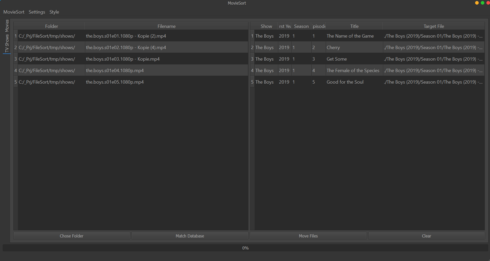
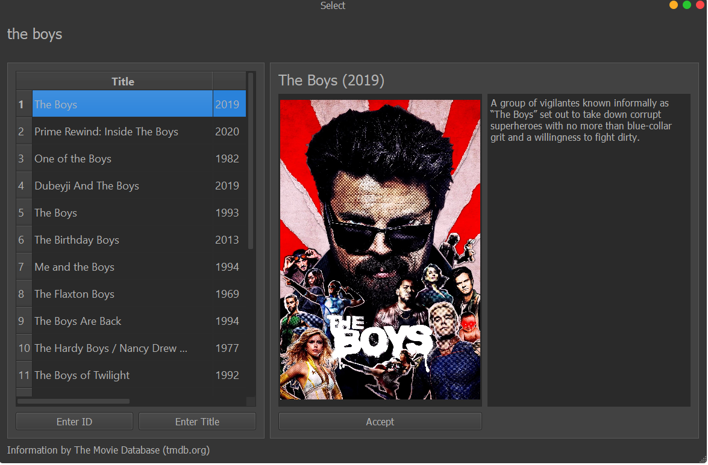
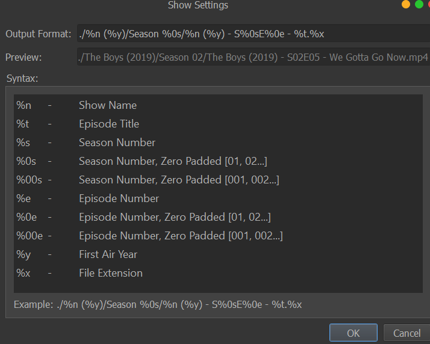
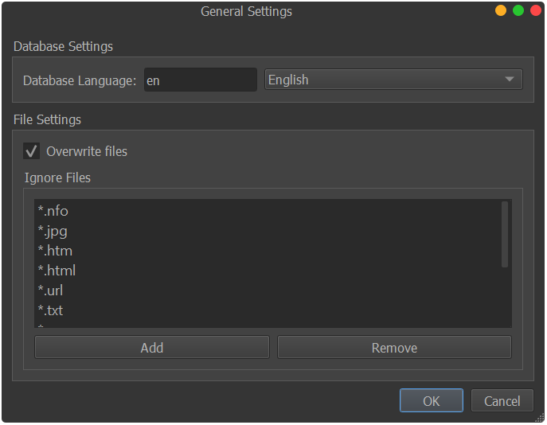

# MovieSort
A first Alpha version is available for Linux and Windows under https://github.com/saschiwy/MovieSort/releases 

- [MovieSort](#moviesort)
  - [Summary](#summary)
    - [Some Impressions](#some-impressions)
  - [Features](#features)
  - [Reason for the Project](#reason-for-the-project)
  - [Output format](#output-format)
    - [Tv Show format](#tv-show-format)
    - [Movie Format](#movie-format)
  - [Command Line Tool](#command-line-tool)
  - [Development Requirements](#development-requirements)
  - [Contributions](#contributions)
  - [Credits](#credits)

## Summary
MovieSort is a tool to automatically move video and tv-show files. Therefore, it uses [The Movie Database](https://www.themoviedb.org/) to fetch the movie data online. The software is written in Python.

### Some Impressions

## Features
- Parse filenames in a defined folder and subfolders
- Obtain information from TMDb about parsed files
- Accept the tools proposal or enter the movie/show ID by your own
- Enter own title if filename is to cryptic
- Create dumps of matched data and give the possibility to customize the output
- Move the matched files
- Custom renaming pattern
- Ignore specified pattern in filenames like, e.g. *.nfo
- Automatic subtitle inclusion if available in 'subs' or 'subtitles' folder
- Preview of the possible movies or shows

And more...

## Reason for the Project
I wanted to learn python, since I like to have a usage of a project I decided to create a software to rename file in an automatized way. I like the capabilities of [FileBot](https://www.filebot.net/), and decided to create something like a clone. However, I want to keep the sources and usage free for anyone and licensed it under GPL.

## Output format
### Tv Show format
|Symbol| Replacement                               |
|------|-------------------------------------------|
|%n    | Show Name                                 |
|%s    | Season Number                             |
|%0s   | Season Number, Zero Padded [01, 02...]    |
|%00s  | Season Number, Zero Padded [001, 002...]  |
|%e    | Episode Number                            |
|%0e   | Episode Number, Zero Padded [01, 02...]   |
|%00e  | Episode Number, Zero Padded [001, 002...] |
|%t    | Episode Title                             |
|%y    | First Air Year                            |
|%x    | File Extension                            |

### Movie Format
|Symbol| Replacement                               |
|------|-------------------------------------------|
|%t    | Movie Title                               |
|%y    | Year                                      |
|%x    | File Extension                            |

 ## Command Line Tool
 Beside the GUI the project contains a command line tool version of MovieSort, called MovieSortCmd. It can be used on a headless system like a download server or to automatize tasks.

The command line tool uses a .json file to be configured. An example is shown below.

~~~~{.json} 
{
    "tv_show_mode":{
        "output_format" : "./%n (%y)/Season %0s/%n (%y) - S%0sE%0e - %t.%x",
        "input_folder" : "./",
        "enable": true
    },
    "movie_mode":{
        "output_format" : "%t (%y)/%t (%y).%x",
        "input_folder" : "./",
        "enable": true
    },
    "language" : "en",
    "dump_data" : true, 
    "auto_rename" : true,
    "set_auto_id": false,
    "tmp_folder" : "./tmp/",
    "refetch_data" : false,
    "overwrite_existing" : true,
    "ignore_pattern": ["*.nfo", "*.jpg", "*.htm", "*.html", '*.txt', "*.png", "*sample*"]
}
~~~~

Save the content to a file, replace the input and output folder and also the format if you like. Then start the tool by:

~~~~
./MovieSortCmd -c <yourFile>
~~~~

## Development Requirements

~~~~
pip install tmdbv3api
pip install qtmodern
pip install qtpy
pip install pyqt5

apt-get install libgl1
~~~~

## Contributions
Feel free to send pull requests, use git-flow-workflow.

## Credits
- [Anthony Bloomer](https://github.com/AnthonyBloomer)
- [The Movie Database](https://www.themoviedb.org/)
- [QtPy: Abstraction layer](https://github.com/spyder-ide/qtpy)
- [QtModern](https://github.com/gmarull/qtmodern)